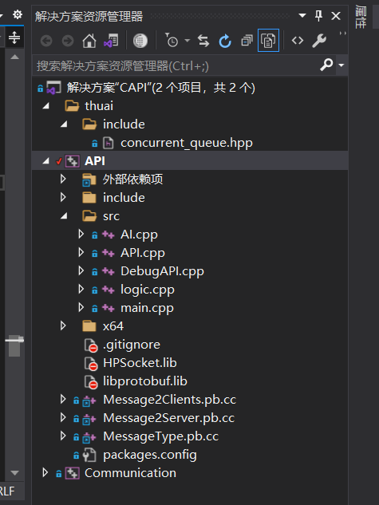
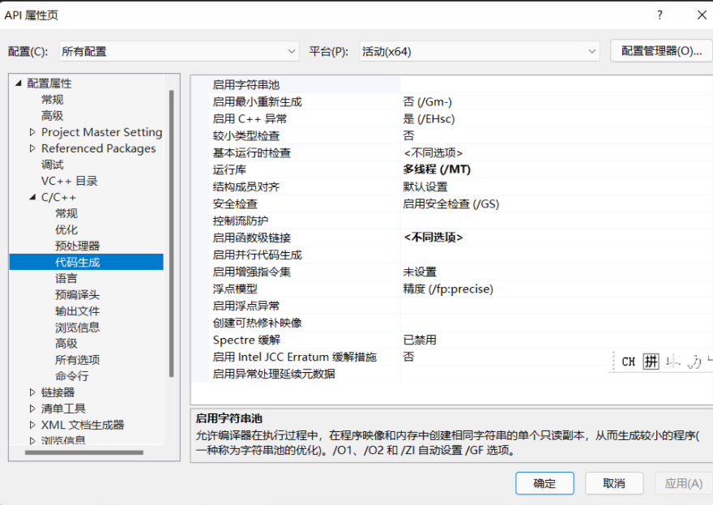
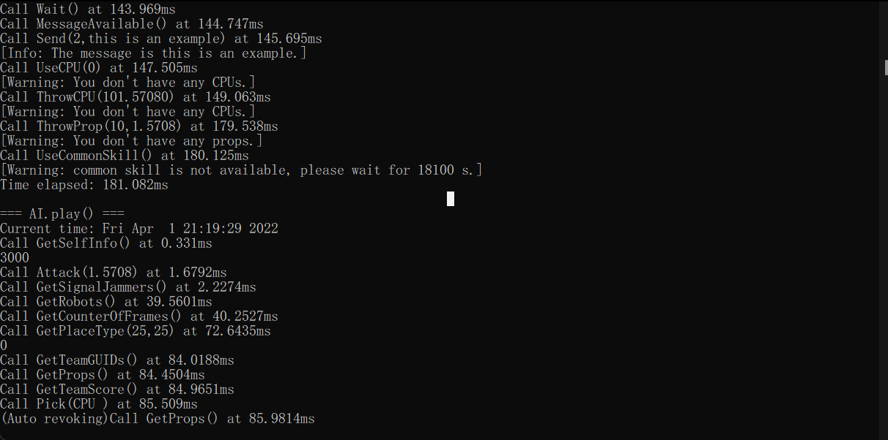
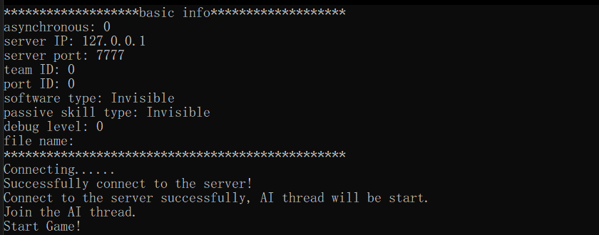

# CAPI（用户接口）使用指南

## 配置

选手所需要的组件可在[https://cloud.tsinghua.edu.cn/d/b8be040bcfc543e096c0/](https://cloud.tsinghua.edu.cn/d/b8be040bcfc543e096c0/)中下载。


### windows

在**x64**生成环境下，选手首先需要将组件包中的`HPSocket.lib`,`libprotobuf.lib`和`libprotobufd.lib`放在 `THUAI5\CAPI\API`文件夹（即与`API.vcxproj`文件相同的目录）下；






**待到生成完毕后，在`THUAI5\CAPI`文件夹（即与`CAPI.sln`文件相同的目录）下，会有一个`x64`文件夹，在此文件夹中可以找到可执行文件`API.exe`，在与`API.exe`相同的文件夹下放置`HPSocket.dll`。**

### Linux

选手首先需要在本机安装`protobuf`([https://github.com/protocolbuffers/protobuf](https://github.com/protocolbuffers/protobuf))模块。

```bash
$ git clone git@github.com:protocolbuffers/protobuf.git
```


以下安装过程可以参考[protobuf installation](https://github.com/protocolbuffers/protobuf/blob/master/src/README.md)

1. 首先需要编译`protobuf`，**安装之前需要添加以下依赖项**：
```bash
$ sudo apt-get install autoconf automake libtool curl make g++ unzip
```
按照以下流程进行编译：
```bash
$ cd CAPI/protobuf
$ ./autogen.sh
$ ./configure
$ make
$ make check
$ sudo make install
$ sudo ldconfig
```

执行完上述指令后，与`protobuf`有关的头文件会存放在`/usr/local/include`中，有关的库会放在`/usr/local/lib`中。

2. 将组件包中的所有`.a`文件放在`CAPI/lib/a`文件夹下，将所有`so.5`和`.so`文件放在`CAPI/lib/so`文件夹下。

3. 使用cmake生成capi可执行文件：
```bash
$ cd CAPI
$ cmake CMakeLists.txt
$ make
```
之后就可以在`CAPI/`文件夹下看到`capi`可执行文件。若想清空生成物，只需执行`make clean`。

4. 在`THUAI5/logic/Server`下执行`dotnet publish`，生成server可执行文件。

5. 之后，只需先运行`THUAI5/logic/bash/*.sh`，再运行`THUAI5/CAPI/bash/*.sh`即可。

## 命令行参数

查看`API.exe`（Linux端为`capi`）的使用方法，可以键入`./API.exe --help`（Linux端为`./capi --help`）。
```
USAGE: 

   ./capi  [-w] [-f <string>] [-d] -t <0|1> -p <0|1|2|3> [-P <USORT>] [-I
           <string>] [--] [--version] [-h]


Where: 

   -w,  --warning
     Warn of some obviously invalid operations (only when "-d" is set).

   -f <string>,  --filename <string>
     Specify a file to store the log.

   -d,  --debug
     Set this flag to use API for debugging.

     If "-f" is not set, the log will be printed on the screen.

     Or you could specify a file to store it.

   -t <0|1>,  --teamID <0|1>
     (required)  Team ID, which can only be 0 or 1

   -p <0|1|2|3>,  --playerID <0|1|2|3>
     (required)  Player ID 0,1,2,3 valid only

   -P <USORT>,  --serverPort <USORT>
     Port the server listens to 7777 in default

   -I <string>,  --serverIP <string>
     Server`s IP 127.0.0.1 in default

   --,  --ignore_rest
     Ignores the rest of the labeled arguments following this flag.

   --version
     Displays version information and exits.

   -h,  --help
     Displays usage information and exits.


   THUAI5 C++ interface commandline parameter introduction
```

一些关键参数的具体说明如下：

* `-f <string>` 当添加此参数后，游戏中输出的调试信息将会被输入到指定的文件中，而不是终端。

* `-d` 如果此参数被指定，终端将会输出更加详细的调试信息，具体区别如下：

  当使用`-d`参数时，终端（或指定文件）将输出详细的函数调用情况。

  

  当删除`-d`参数时，除了基础信息之外，系统将不会输出函数调用情况。

  

  当选手想要查看具体的游戏信息时，可以添加`-d`属性；但如果想要追求丝滑的游戏体验，则推荐删除该参数，否则频繁的io将拖累系统速度。

* `-P <USHORT>` server端口，一般不需要改动。

* `-I <string>` server IP，一般不需要改动。

* `-t <0/1>` 指定team ID。

* `-p <0|1|2|3>` 指定player ID。

* `-w` 当`-d`参数被指定时，指定`-w`参数可以输出一些警告信息，如在人物死亡时执行移动操作，系统将输出警告信息："[Warning: You have been slained.]"。

## 用户接口

**请选手先仔细阅读`CAPI/API/include/structure.h`**

用户可供使用的接口如下：
```cpp
class IAPI
{
public: 
    //***********选手可执行的操作***********//
    
    // 移动
    virtual bool MovePlayer(uint32_t timeInMilliseconds, double angleInRadian) = 0;
    virtual bool MoveRight(uint32_t timeInMilliseconds) = 0;
    virtual bool MoveUp(uint32_t timeInMilliseconds) = 0;
    virtual bool MoveLeft(uint32_t timeInMilliseconds) = 0;
    virtual bool MoveDown(uint32_t timeInMilliseconds) = 0;
    virtual bool Attack(double angleInRadian) = 0;
    virtual bool UseCommonSkill() = 0;
    virtual bool Send(int toPlayerID,std::string) = 0;
    virtual bool Pick(THUAI5::PropType) = 0; 
    virtual bool ThrowProp(uint32_t timeInMilliseconds, double angleInRadian) = 0;
    virtual bool UseProp() = 0;
    virtual bool ThrowCPU(uint32_t timeInMilliseconds, double angleInRadian,uint32_t cpuNum) = 0;
    virtual bool UseCPU(uint32_t cpuNum) = 0;
    virtual bool Wait() = 0;

    //***********选手可获取的信息***********//
    [[nodiscard]] virtual bool MessageAvailable() = 0;
    [[nodiscard]] virtual std::optional<std::string> TryGetMessage() = 0;
    [[nodiscard]] virtual std::vector<std::shared_ptr<const THUAI5::Robot>> GetRobots() const = 0;
    [[nodiscard]] virtual std::vector<std::shared_ptr<const THUAI5::Prop>> GetProps() const = 0;
    [[nodiscard]] virtual std::vector<std::shared_ptr<const THUAI5::SignalJammer>> GetSignalJammers() const = 0;
    [[nodiscard]] virtual std::shared_ptr<const THUAI5::Robot> GetSelfInfo() const = 0;
    [[nodiscard]] virtual THUAI5::PlaceType GetPlaceType(int32_t CellX, int32_t CellY) const = 0;
    [[nodiscard]] virtual uint32_t GetTeamScore() const = 0;
    [[nodiscard]] virtual const std::vector<int64_t> GetPlayerGUIDs() const = 0;
    [[nodiscard]] virtual int GetFrameCount() const = 0;

    //***********选手可能用到的辅助函数***********//
    [[nodiscard]] static inline int CellToGrid(int cell) noexcept // 获取指定格子中心的坐标
    [[nodiscard]] static inline int GridToCell(int grid) noexcept // 获取指定坐标点所位于的格
};
```

### 选手主动行为

除发消息以外，所有主动行为只有角色存活时才能进行。

#### 移动
* `bool MovePlayer(uint32_t timeInMilliseconds, double angleInRadian)`：指挥本角色进行移动，`timeInMilliseconds` 为移动时间，单位为毫秒；`angleInRadian` 表示移动的方向，单位是弧度，使用极坐标——**竖直向下方向为 x 轴，水平向右方向为 y 轴**。在移动过程中，人物将会阻塞，期间不能进行任何操作，例如改变移动方向、攻击等。因此不鼓励选手面向地图编程，因为移动过程中你可以受到多种干扰使得移动结果不符合你的预期；因此建议小步移动，边移动边考虑之后的行为。

* `bool MoveRight(uint32_t timeInMilliseconds)`：即向右移动，除了不需要指定 `angle` 之外，与 `MovePlayer` 相同。`MoveLeft`、`MoveDown`、`MoveUp` 同理。

#### 道具操作
* `bool Pick(THUAI5::PropType propType)` ：捡起与自己处于同一个格子（cell）的道具。由于一个格子可能存在多个道具，因此需要用 `propType` 指定要捡起的道具类型。注意当多人拾取时只有一个人会得到道具，因此 `Pick` 操作**有可能会失败**。

* `bool Throw(uint32_t timeInMilliseconds, double angleInRadian) `：扔出手中的道具（如果有的话），使其变为未捡起状态，可以供他人捡起。两个参数的含义与 `MovePlayer` 相同。

* `bool UseProp()`：使用道具。

#### 攻击
* `bool Attack(double angleInRadian)`：发射信号干扰器进行攻击。`angleInRadian`给出了信号干扰器的发射方向，信号干扰器的移动速度（每秒飞行的坐标数）已经在 `Constants.h` 中给出。

#### 主动技能
* `bool UseCommonSkill()`：使用主动技能。

#### 发送消息
* `bool Send(int toPlayerID, std::string message)`：给同队的队友发送消息。`toPlayerID` 指定发送的对象，`message` 指定发送的内容。`message` 的长度**不能超过 64**，否则将发送失败！

#### CPU操作
* `bool ThrowCPU(uint32_t timeInMilliseconds, double angleInRadian, uint32_t cpuNum)`：扔出手中的CPU（如果有的话），使其变为未捡起状态，可以供他人捡起。前两个参数的含义与 `MovePlayer` 相同，最后一个参数为CPU数。
* `bool UseCPU(uint32_t cpuNum)`：使用手中的CPU，可指定使用个数。

#### 信息受限
以上**主动行为**具有频率限制，每 50ms 最多总共可以调用 50 次；主动返回 `bool` 值代表本次操作是否成功，如果超过了通信次数限制，则会返回 `false`。

`virtual bool Wait() = 0;`

`asynchronous` 为 `true` 的情况下，选手可以调用此函数，阻塞当前线程，直到下一次消息更新时继续运行。若等待时游戏已经结束，则不会进行等待，并返回 `false`。

### 信息获取

#### 个人信息
* `std::shared_ptr<const THUAI5::Robot> GetSelfInfo() const`：返回自身的信息。

#### 队伍信息
* `uint32_t GetTeamScore() const`：返回本队当前分数。

#### 玩家GUID信息
* `const std::vector<int64_t> GetPlayerGUIDs() const`：返回一个数组，存储了场上所有玩家的GUID（全局唯一标识符）。

#### 游戏实物信息

* `std::vector<std::shared_ptr<const THUAI5::Robot>> GetRobots() const`：返回当前场地内的所有可视玩家的信息。

* `std::vector<std::shared_ptr<const THUAI5::Prop>> GetProps() const`：返回当前场地内的所有**尚未被捡起的**的可视道具的信息。其他信息同上。

* `std::vector<std::shared_ptr<const THUAI5::SignalJammer>> GetSignalJammers() const`：返回当前场地内的所有可视信号干扰器的信息。其他信息同上。

* `THUAI5::PlaceType GetPlaceType(int CellX, int CellY) const`：返回某一位置场地种类信息。注意此处的`CellX`和`CellY`指的是**地图格数**，而不是**绝对坐标**。
场地种类详见`structure.h`。

#### 队友信息
* `bool MessageAvailable()`：如果当前有队友发来的尚未接收的信息，返回 `true`。

* `std::optional<std::string> TryGetMessage()`：获取队友发来的信息，注意当信息队列为空时，返回`nullptr`。

#### 其他信息
* `int GetFrameCount() const`：获取游戏已经进行的帧数。

### 辅助函数
* `static inline int CellToGrid(int cell) noexcept`：将地图格数`cell`转换为绝对坐标`grid`。

* `static inline int GridToCell(int grid) noexcept`：将绝对坐标`grid`转换为地图格数`cell`。

