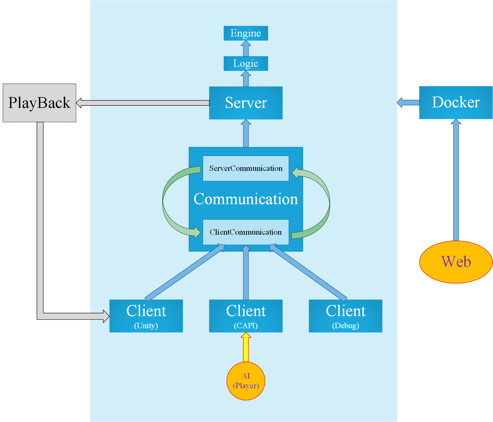

# THUAI5

THUAI5：清华大学第五届人工智能挑战赛电子系赛道（原电子系第二十三届队式程序设计大赛）

## 赛题简介

待定

## 比赛规则

比赛规则参见 [game-rules](./logic/GameRules.md)  

## 软件架构

计划架构如下：  

## 仓库说明

本仓库为所有开发工作共用仓库，请勿上传不必要的文件。本仓库采用 git 作为版本控制系统，每个子目录内均已经预先包含由 Visual Studio 2019 自动生成的 `.gitignore`，可以根据自身需要增加忽略规则。主目录内的 `.gitignore` 非必要尽量不要修改；为了防止行尾不一致的问题，主目录内已经配置了 `.gitattributes` 以进行行尾标准化，非必要也尽量不要修改，如果有必要可以在子目录内自定义 `.gitattributes`。  

### 目录分配

|    子目录     |                           说明                           |           主要开发组           |
| :-----------: | :------------------------------------------------------: | :----------------------------: |
|    .github    |          CI，用于选手包同步到服务器上供选手下载          |             赛事组             |
|     CAPI      |                 选手接口，生成可执行文件                 |         通信组、赛事组         |
| communication |                  C# 通信组件，生成类库                   |             通信组             |
|  dependency   | 依赖文件，如 proto、dll、dockerfile、nupkg、shell 脚本等 | 逻辑组、通信组、赛事组、界面组 |
|   installer   |      下载器，用于选手包的下载与更新，生成可执行文件      |             赛事组             |
|   interface   |                        Unity 界面                        |             界面组             |
|   launcher    |       游戏启动器，用于快速启动游戏，生成可执行文件       |             赛事组             |
|     logic     |                 游戏逻辑，生成可执行文件                 |             逻辑组             |
|   playback    |                  游戏回放组件，生成类库                  |             逻辑组             |
|   resource    |        资源目录，用于存储主目录下 README 所用图片        |            端茶倒水            |

详情参见各子目录内的 README，各个开发组成员请详细阅读自己所负责子目录内的 README，并推荐阅读所有子目录内的 README，便于了解整体的开发工作，互相交流合作。  

### 分支

+ master：工作较稳定的版本或阶段性成果，需要 2 reviewers，但由总负责人（端茶倒水）维护
+ dev：各个小组开发工作最新进展，需要 1 reviewer

## 开发规则

### 关于社区开发者

+ 社区开发者开发时请遵循 [THUAI5 社区开发者贡献指南](./CONTRIBUTING.md)  
+ 社区开发者贡献的代码请遵循 [Contributor Covenant Code of Conduct](./CODE_OF_CONDUCT.md)  

### 使用 Git 与 Github 进行开发的流程

使用 Git 与 GitHub 进行协作开发的过程中，各个开发组成员应当遵守下面的流程：  

1. 将 eesast 仓库 fork 到个人 GitHub 仓库中
2. 创建自己的分支
3. 进行开发
4. 将 eesast 仓库 dev 分支的最新进度 pull 到自己的仓库中
5. 向科协仓库的 dev 分支提出 pull request

### 使用 Git 与 Github 时的注意事项

+ commit 时的提交信息遵守 Semantic Commit 格式  
+ 不要将不必要的大文件上传到 GitHub  
+ 鼓励开发组成员之间互相 review 并 merge 代码到 dev 分支上。merge 之前建议简单检查其 pull request 是否符合上述规范  
+ 不要向 master 分支提出 pull request，更不要 merge 到 master 分支上  
+ 不要 merge 无法通过 CI 的 pull request  

### 统一约定  

+ 统一使用空格缩进而非制表符缩进  
+ 统一使用 4 个空格进行缩进而非 2 个  
+ 统一使用 UTF-8  字符编码  

## 其他注意事项

+ 文件的字符编码格式须统一使用 UTF-8 编码，并用 4 空格缩进，尤其是 C/C++：Visual Studio 创建 cpp 文件时默认使用 GB2312 编码、TAB 缩进，因此每创建一个文件都需要注意手动设置字符编码（当代码文件中出现中文时）和缩进方式  

+ 使用等宽字体进行编程，例如 Source Code Pro、Consolas 等，便于对齐  

+ 注意代码的整洁性与可读性  

  + 代码风格尽量统一。书写不要过于紧凑，善于使用空格、缩进与换行来让代码看起来更整洁  

  + 命名风格尽量统一。相同类别的命名规则要相同，例如类名统一使用大驼峰命名法或其他常用的命名法，但是不要混用（非必要不要使用匈牙利命名法）  

  + 命名应当明白易懂。除循环变量等可以使用 `i`、`j`、`k` 等单字母外，其他的命名应当明白如话，且谨慎使用缩写。尽量使用众人皆知的缩写，不要自创缩写。如果连自己都不知道的缩写或根本没有众人皆知的缩写，则应当坚持使用全称，不要害怕变量名长。常用的缩写有：  

    > address-addr、answer-ans、application-app、arguments-args、array-arr、assemble-asm、(a)synchronize-(a)sync、attribute-attr、begin-beg、bitmap-bmp、buffer-buf、button-btn、clock-clk、command-cmd、coordinates-coord、copy-cpy、count-cnt、current-cur、database-db、decrease-dec、default/define-def、delete-del、dependency-dep、destination-dest、device-dev、dialog-dlg、dictionary-dict、display-disp、divide-div、document-doc、educate-edu、equal-eq、error-err、extend-ext、format-fmt、frequency-freq、function-func、horizon-horz、image-img、implement-impl、increment-inc、index-idx、information-info、initialize-init、instance-inst、iterator-itr、length-len、list-lst、memory-mem、message-msg、middle-mid、number-num、object-obj、package-pkg、parameter-param、password-pwd、pointer-ptr、position-pos、previous-prev、receive-recv、reference-ref、resource/result-res、return-ret、second-sec、select-sel、semaphore-sem、signal-sig、source-src、stack-stk、standard-std、statistic/state-stat、string-str、system-sys、temporary-temp/tmp、text-txt、user-usr、value-val、variable-var、version-ver、vertical-vert、window-win  

    当然命名也不能太过啰嗦，能完整表明意图即可，过于啰嗦的变量名也是不好的  

  + 代码应保证可读性，清楚易懂。严禁中学 OI 竞赛的各种“卡常”奇技淫巧！！！一来相信编译器优化能力比人肉优化好得多，二来运行时效率不总是最重要的，保证代码可读性与可维护性有时更加重要  

+ 注意代码的可维护性。面向对象编程时：  
  + 慎用全局变量、全局函数等  
  + 降低类与类之间的耦合性：多间接依赖，少直接依赖，避免双向依赖、环形依赖，善用继承与多态；降低模块与模块之间的耦合性，便于进行单元测试  
  
+ 注意代码的复用性。将各部分模块化，便于以后的复用  

+ 注意跨平台的问题，尽量同时支持 windows 与 linux，避免直接的系统调用带来的跨平台问题  

+ 发布时请在 Release 模式下发布而不是 Debug，并且要确认代码在 Debug 和 Release 模式下均能正常构建并正确运行  

+ 适时维护开发文档等资料，便于后来维护者更快看懂代码  

+ 做好部会记录，及时记录饼和锅，以及赛题规则等，避免日后忘记  

+ 小组内进行合理的分工，尽量避免一个人工作过多或过少  

+ 多了解其他人的开发进度，增加互相之间的协作，遇到困难互相帮助，奥里给  

## 开发组成员

+ 逻辑组：张鹤龄、刘浩然、唐昌礼
+ 通信组：彭沁禾、方家培、王与进
+ 界面组：张子扬、邵晨扬
+ 赛事组：黄印桓、付宇辉
+ 端茶倒水：刘雪枫  

