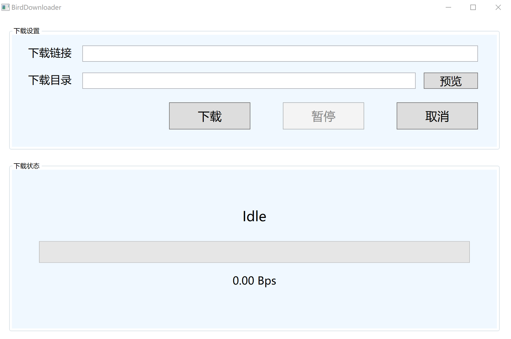

# experimental/ResumableDownloader

项目代码见[birdx-007/Resumable_Downloader: 支持断点续传的下载器（WPF应用程序） (github.com)](https://github.com/birdx-007/Resumable_Downloader)。

## 简介

实验性探索内容。支持断点续传的下载器。目前已有第一个可基本顺利运行的版本。

界面：

搭建环境：.NET6.0	VS2022	基于C#的WPF应用程序

框架：Prism MVVM框架

实验人员：刘浩然

功能：输入下载链接、下载目录（下载目录可通过“预览”便捷选择）进行下载；若发现下载目录下有同名临时文件，则进行续传下载；下载中途暂停下载，继续下载，任意时刻取消下载；显示下载进度及下载速度。
