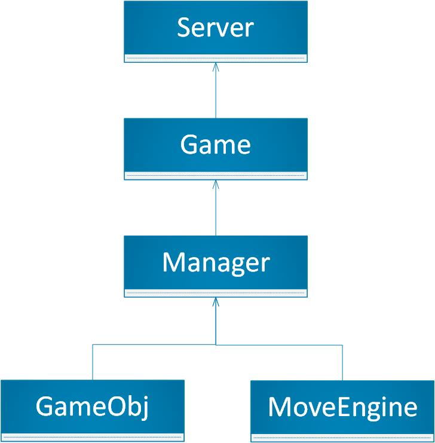

# logic

## 简介

游戏逻辑与选手简易调试 GUI 客户端  

## 逻辑架构

## 目标

### 基本目标

+ 编写游戏底层逻辑，生成 .NET 类库
+ 编写服务器端逻辑，生成 .NET 控制台应用程序 `Server`，服务器端逻辑应当至少实现：  
  + 游戏的组队与运行  
  + 回放文件的生成  
+ 使用 WPF 或 Winform，为 Windows 平台编写简单的带有 2D 图形界面的客户端 `Client`，供选手在本地调试，客户端应当至少实现下面的功能：  
  + 游戏直播观战  
  + 回放文件的播放  

### 重要目标

+ 分离游戏引擎、游戏逻辑与通信逻辑，使得游戏引擎和通信逻辑可以供日后复用  
+ 调试客户端支持玩家手动对战  
+ 使调试用客户端尽可能看起来清晰明了、运行快速，越简单越好（简单但不是简陋）  

### 提高目标（饼）

+ 学习并使用 MAUI，实现调试客户端的跨平台  

## 统一约定

+ 目标平台：.NET 5；可能根据进度改为 .NET 6（至少有一个开发组使用了 MAUI 时改为 .NET 6）  

## 注意事项

+ 服务器的逻辑要特别注意鲁棒性和异常安全性，应当能够在各种极端情况下运行良好，对于选手的输入要进行各种合法检查，以避免某一位玩家的非法输入导致服务器崩溃而造成其他玩家也无法游戏的情形，例如浮点数的 `NaN` 与 `Inf`、枚举类型的值非法、运算的溢出，等等  
+ 注意游戏引擎、游戏逻辑、服务器通信的相互分离，便于代码维护与复用  
+ 设计好分工，分工前设计大致的代码架构，根据代码架构进行均匀合理的分工  
+ 设计代码架构时，注意类与类之间、模块与模块之间尽量松耦合，每个部分的工作尽量相互独立，便于进行单元测试、BUG 修复，等等  
+ 尽量考虑程序的通用性与可扩展性，便于以后加入新的功能；善于面向对象的设计模式，不要不用也不要乱用  
+ 避免依赖过多的全局资源  
+ 设计良好的调试接口，便于调试  

## 特别说明  

+ 在参考去年版本时注意，THUAI4 中 THUnity2D 项目存在历史遗留问题，因此设计上不尽人意。`Interfaces` 应当属于游戏引擎的内容，而 `ObjClasses` 应当属于游戏逻辑的内容，因此两者不应当在一个项目内  

## 开发人员

+ 唐昌礼，张鹤龄，刘浩然

